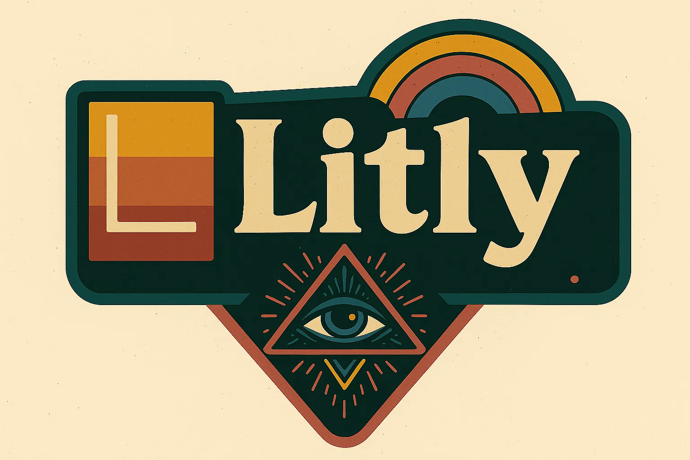

# Litly-Dubbing
**Comprehensive AI-Driven Video Dubbing & Localization Suite with Advanced Generative AI Integration**

<div align="center">
<br>

[](LICENSE)
[](https://www.python.org/)
[](https://pytorch.org/)

**[English](#litly-dubbing) | [](#litly-dubbing)**

</div>

---

## Table of Contents

1. [Overview](#overview)
2. [Core Vision](#core-vision)
3. [Technical Architecture](#technical-architecture)
4. [Key Features](#key-features)
5. [Generative AI Interfaces](#generative-ai-interfaces)
6. [Installation Guide](#installation-guide)
7. [Usage](#usage)
8. [License & Attribution](#license--attribution)

---

## Overview

**Litly-Dubbing** is an enterprise-grade, locally-executable AI-powered video dubbing and localization platform designed for professional content creators, media production companies, and global entertainment organizations. 

This comprehensive solution addresses the complex challenge of creating authentic, multi-lingual dubbed content while maintaining visual synchronization and vocal authenticity. Unlike traditional dubbing workflows that require manual synchronization and extensive post-processing, Litly-Dubbing orchestrates cutting-edge generative AI technologies to automate the entire pipeline—from speech recognition and intelligent translation through voice synthesis and precise lip-synchronization.

The platform operates entirely on local infrastructure, eliminating dependency on external APIs and ensuring complete privacy and control over proprietary content.

---

## Core Vision

Litly-Dubbing was conceived to solve a fundamental problem in global content distribution: **Creating high-quality, culturally-adapted dubbed audio while maintaining natural lip-sync and speaker voice authenticity—completely offline and with full configurability.**

### Problem Statement
Traditional video dubbing requires:
- Manual speech-to-text transcription (error-prone, time-consuming)
- Professional human translators (expensive, limited availability)
- Voice actors with specific vocal characteristics (rare, costly)
- Manual frame-by-frame lip-sync adjustment (labor-intensive)
- Multiple software tools and complex workflows

### Our Solution
A unified, end-to-end pipeline that:
- **Automatically captures** source audio characteristics via AI voice identification
- **Intelligently translates** while preserving context, tone, and cultural nuance via Large Language Models
- **Clones the original voice** in the target language using advanced speech synthesis
- **Synchronizes lip movements** with the new audio track via real-time video frame manipulation
- **Processes multi-track audio** (dialogue, music, effects) independently for professional-grade results

---

## Technical Architecture

Litly-Dubbing integrates five distinct Generative AI subsystems into a cohesive, configurable framework:

```
┌─────────────────────────────────────────────────────────────────┐
│                    VIDEO INPUT STREAM                           │
└────────────────────────────┬────────────────────────────────────┘
                             │
         ┌───────────────────┴───────────────────┐
         │                                       │
         ▼                                       ▼
  ┌──────────────────┐               ┌──────────────────┐
  │  Audio Extraction│               │  Video Frames    │
  │  & Separation    │               │  (Preservation)  │
  └────────┬─────────┘               └──────────────────┘
           │
           ▼
  ┌──────────────────────────────────┐
  │   1. VOICE RECOGNITION (ASR)     │
  │  ┌─ WhisperX / FunASR            │
  │  └─ Speaker Diarization          │
  │  └─ Speech-to-Text Transcription │
  └────────┬─────────────────────────┘
           │
           ▼
  ┌──────────────────────────────────┐
  │   2. INTELLIGENT TRANSLATION      │
  │  ┌─ LLM Integration (Ollama)      │
  │  ├─ GPT / Qwen / Local LLMs       │
  │  ├─ Context-Aware Translation     │
  │  ├─ Text Rewriting & Elaboration  │
  │  └─ Multi-lingual Support         │
  └────────┬─────────────────────────┘
           │
           ▼
  ┌──────────────────────────────────┐
  │   3. VOICE SYNTHESIS              │
  │  ┌─ Voice Cloning (GPT-SoVITS)    │
  │  ├─ CosyVoice Multi-Lang Support  │
  │  ├─ XTTS (Few-shot TTS)           │
  │  └─ Emotional Tone Preservation   │
  └────────┬─────────────────────────┘
           │
           ▼
  ┌──────────────────────────────────┐
  │   4. LIP-SYNCHRONIZATION          │
  │  ┌─ Wav2Lip / SadTalker           │
  │  ├─ Frame-Level Lip Matching      │
  │  ├─ Natural Mouth Animation       │
  │  └─ Real-time Video Retalking     │
  └────────┬─────────────────────────┘
           │
           ▼
  ┌──────────────────────────────────┐
  │   5. ADVANCED CUSTOMIZATIONS      │
  │  ┌─ Face-Swap (Deepfake Synthesis)│
  │  ├─ Style Transfer Effects        │
  │  ├─ SFX/Audio Generation          │
  │  └─ AI-Powered Post-Processing    │
  └────────┬─────────────────────────┘
           │
           ▼
  ┌──────────────────────────────────┐
  │      OUTPUT: Dubbed Video         │
  │  ┌─ New Audio Track               │
  │  ├─ Synchronized Lip Movements    │
  │  ├─ Optional Face Updates         │
  │  └─ Professional Audio Mixing     │
  └──────────────────────────────────┘
```

---

## Key Features

### 🎤 **Multi-Track Audio Processing**
- Independent processing of dialogue, background music, and sound effects
- Vocal/accompaniment separation via **UVR5** and **Demucs**
- Preserves original music while replacing only dialogue
- Maintains spatial audio characteristics

### 🗣️ **Intelligent Speech Recognition**
- **WhisperX**: High-precision transcription with word-level timestamps
- **FunASR**: Optimized for multilingual support (Chinese, English, Japanese, etc.)
- Automatic speaker identification and diarization
- Handles overlapping speech and complex audio scenarios

### 🌐 **Advanced LLM Integration**
- **Local LLM Support**: Ollama, LM Studio, text-generation-webui
- **Translation**: Context-aware translation with semantic preservation
- **Text Enhancement**: Elaboration, rewriting, and style adaptation
- **Custom Agents**: Extensible for specialized use cases (medical terminology, technical jargon, etc.)

### 🎙️ **State-of-the-Art Voice Synthesis**
- **GPT-SoVITS**: Few-shot voice cloning (3-10 seconds of reference audio)
- **CosyVoice**: Multi-language synthesis with emotional control
- **XTTS v2**: Cross-lingual voice transformation
- Emotional tone and speaker characteristics preservation

### 👄 **Precise Lip-Synchronization**
- **Wav2Lip**: Frame-by-frame lip movement generation
- **SadTalker**: Advanced facial animation with natural expressions
- Automatic mouth shape prediction based on audio phonetics
- Temporal alignment with sub-frame accuracy

### 🎬 **Optional Visual Enhancement**
- **Face-Swap Technology**: Realistic deepfake-style character substitution
- **Style Transfer**: AI-powered visual effects
- **Image Synthesis**: Text-to-Image via Stable Diffusion for custom backgrounds

### ⚙️ **Flexible Configuration System**
- Automatic setup and download of required models
- Modular architecture for selective feature activation
- CUDA/CPU inference support (11.8, 12.1, and higher)
- Multi-GPU optimization for batch processing

### 🖥️ **Professional WebUI Interface**
- Intuitive drag-and-drop video uploading
- Real-time parameter configuration
- Visual preview of processing stages
- Batch processing capabilities
- Export in multiple formats (MP4, WebM, etc.)

---

## Generative AI Interfaces

Litly-Dubbing's technical foundation rests on integrating five specialized Generative AI subsystems:

### 1️⃣ **Voice Identification & Speech Transcription**
| Technology | Purpose | Source |
|-----------|---------|--------|
| **WhisperX** | High-precision ASR with timestamps | OpenAI (extended) |
| **FunASR** | Multilingual speech recognition | Alibaba DAMO |
| **Pyannote** | Speaker diarization (optional) | Meta / HuggingFace |

### 2️⃣ **Speech Synthesis (Voice Cloning + TTS)**
| Technology | Capability | Characteristics |
|-----------|-----------|-----------------|
| **GPT-SoVITS** | Few-shot voice cloning | High quality, realistic, 3-10s training |
| **CosyVoice** | Multi-lang synthesis | 150k+ hours training, emotional control |
| **XTTS v2** | Cross-lingual TTS | Real-time capable, good quality |

### 3️⃣ **SFX/Audio Synthesis (Text-to-Sound)**
| Tool | Purpose |
|------|---------|
| **Edge TTS** | Fallback text-to-speech |
| **Custom Audio Models** | Extensible architecture |

### 4️⃣ **Large Language Model Integration**
- **Translation**: Multi-language semantic-preserving translation
- **Text Completion**: Context-aware elaboration
- **Text Rewriting**: Style adaptation and localization
- **Custom Automation**: Pluggable agents for specialized workflows

**Supported LLM Backends:**
- `Ollama` (local, open-source models)
- `LM Studio` (Windows/Mac compatible)
- `text-generation-webui`
- `OpenAI API` (optional)
- `Qwen` (local inference)
- `Baidu Ernie Bot` (with API)

### 5️⃣ **Visual Synthesis (Image-to-Image, Face-to-Face)**
| Technology | Function |
|-----------|----------|
| **Wav2Lip** | Lip-sync from audio |
| **SadTalker** | Facial animation + lip-sync |
| **Stable Diffusion** | Text-to-Image (backgrounds, effects) |
| **FaceFusion** | Face-swap / Deepfake synthesis |

---

## Installation Guide

### Prerequisites
- **OS**: Linux, macOS, or Windows
- **GPU**: NVIDIA with CUDA 11.8+ (recommended), or CPU-only mode
- **Python**: 3.10 or 3.11
- **Memory**: Minimum 8GB RAM, recommended 16GB+
- **Storage**: 50GB+ for model weights

### Step 1: Clone the Repository

```bash
git clone https://github.com/MacMillingComputerSoftwareEntertainment/Litly-Dubbing.git --depth 1
cd Litly-Dubbing
git submodule update --init --recursive
```

### Step 2: Create Python Environment

```bash
# Using conda (recommended)
conda create -n litly_dubbing python=3.10 -y
conda activate litly_dubbing

# Install ffmpeg
conda install ffmpeg==7.0.2 -c conda-forge
```

### Step 3: Install Dependencies

```bash
# Upgrade pip
python -m pip install --upgrade pip

# Install PyTorch (select your CUDA version)
# For CUDA 12.1:
pip install torch==2.3.1 torchvision==0.18.1 torchaudio==2.3.1 --index-url https://download.pytorch.org/whl/cu121

# Or for CUDA 11.8:
pip install torch==2.3.1 torchvision==0.18.1 torchaudio==2.3.1 --index-url https://download.pytorch.org/whl/cu118

# Install project dependencies
pip install -r requirements.txt
pip install -r requirements_module.txt
```

### Step 4: Configure Environment Variables

```bash
# Copy the example configuration
cp env.example .env

# Edit .env with your settings
# Minimal configuration requires:
# - MODEL_NAME (e.g., "Qwen/Qwen1.5-4B-Chat" for local)
# - HF_TOKEN (for model downloads)
# - Optional: OPENAI_API_KEY (if using OpenAI models)
```

### Step 5: Download Models

```bash
# Linux
bash scripts/download_models.sh

# Windows
python scripts/modelscope_download.py
```

### Step 6: Launch the Application

```bash
python webui.py
```

Access the interface at `http://127.0.0.1:6006`

---

## Usage

### Basic Workflow

1. **Upload Video**: Drag-and-drop or select your video file
2. **Configure Processing**:
   - Select target language(s)
   - Choose voice cloning model (GPT-SoVITS, CosyVoice, or XTTS)
   - Set LLM model for translation (Qwen, OpenAI, etc.)
   - Enable/disable lip-sync, face-swap, audio separation
3. **Process**: Click "Dubbing" to start the pipeline
4. **Review & Export**: Preview results, adjust parameters if needed, export final video

### Advanced Configuration

```python
# Custom pipeline via Python API (example)
from litly_dubbing import DubbingPipeline

pipeline = DubbingPipeline(
    asr_model="whisperx",
    llm_backend="ollama",  # "ollama", "openai", "qwen"
    voice_synthesis="gpt-sovits",
    lip_sync_engine="wav2lip",
    face_swap_enabled=False,
    language_pairs=["en-de", "en-fr", "en-ja"],
    max_workers=2  # GPU parallelization
)

result = pipeline.process_video(
    input_path="input.mp4",
    target_languages=["de", "fr"],
    voice_reference_samples=5  # seconds
)
```

---

## Technology Stack Summary

| Component | Implementation | Model(s) |
|-----------|-----------------|----------|
| **Speech Recognition** | WhisperX / FunASR | faster-whisper-large-v3 |
| **Voice Cloning** | GPT-SoVITS / CosyVoice | Pre-trained transformers |
| **LLM Translation** | Ollama / LM Studio | Qwen-1.5-4B, Llama-2, etc. |
| **Lip Sync** | Wav2Lip / SadTalker | GAN-based models |
| **Face Synthesis** | Stable Diffusion / FaceFusion | Diffusion models |
| **Audio Separation** | UVR5 / Demucs | Conv-TasNet architectures |

---

## License & Attribution

### License
Litly-Dubbing is released under the **Apache License 2.0**. For details, see the [LICENSE](LICENSE) file.

### Attribution
This project is a customized, enhanced fork of [Linly-Dubbing](https://github.com/Kedreamix/Linly-Dubbing) by [Kedreamix](https://github.com/Kedreamix).

We gratefully acknowledge the following open-source projects whose innovations make this platform possible:

- **[Linly-Dubbing](https://github.com/Kedreamix/Linly-Dubbing)** – Core dubbing framework
- **[Linly-Talker](https://github.com/Kedreamix/Linly-Talker)** – Lip-sync technology
- **[Coqui TTS](https://github.com/coqui-ai/TTS)** – XTTS voice synthesis
- **[GPT-SoVITS](https://github.com/RVC-Boss/GPT-SoVITS)** – Advanced voice cloning
- **[CosyVoice](https://github.com/FunAudioLLM/CosyVoice)** – Alibaba's speech synthesis
- **[FunASR](https://github.com/alibaba-damo-academy/FunASR)** – Speech recognition
- **[WhisperX](https://github.com/m-bain/whisperX)** – Precise transcription
- **[Wav2Lip](https://github.com/Rudrabha/Wav2Lip)** – Lip synchronization
- **[SadTalker](https://github.com/OpenTalker/SadTalker)** – Facial animation
- **[Ultimate Vocal Remover](https://github.com/Anjok07/ultimatevocalremovergui)** – Audio separation
- **[Demucs](https://github.com/facebookresearch/demucs)** – Music source separation

### Legal Notice

> **Important**: When using Litly-Dubbing, you must comply with all applicable laws, including:
> - Copyright law (use only licensed or authorized content)
> - Data protection regulations (GDPR, CCPA, etc.)
> - Privacy law (obtain appropriate consent for voice/face usage)
> - Local content guidelines and platform policies
>
> Unauthorized dubbing of copyrighted material is prohibited.

---

## Support & Contribution

For issues, feature requests, or contributions:
- **Issues**: [GitHub Issues](https://github.com/MacMillingComputerSoftwareEntertainment/Litly-Dubbing/issues)
- **Discussions**: [GitHub Discussions](https://github.com/MacMillingComputerSoftwareEntertainment/Litly-Dubbing/discussions)
- **Contributing**: See [CONTRIBUTING.md](CONTRIBUTING.md)

---

**Last Updated**: 2025-11-29  
**Maintained by**: MacMillingComputerSoftwareEntertainment  
**Upstream**: [Kedreamix/Linly-Dubbing](https://github.com/Kedreamix/Linly-Dubbing)
